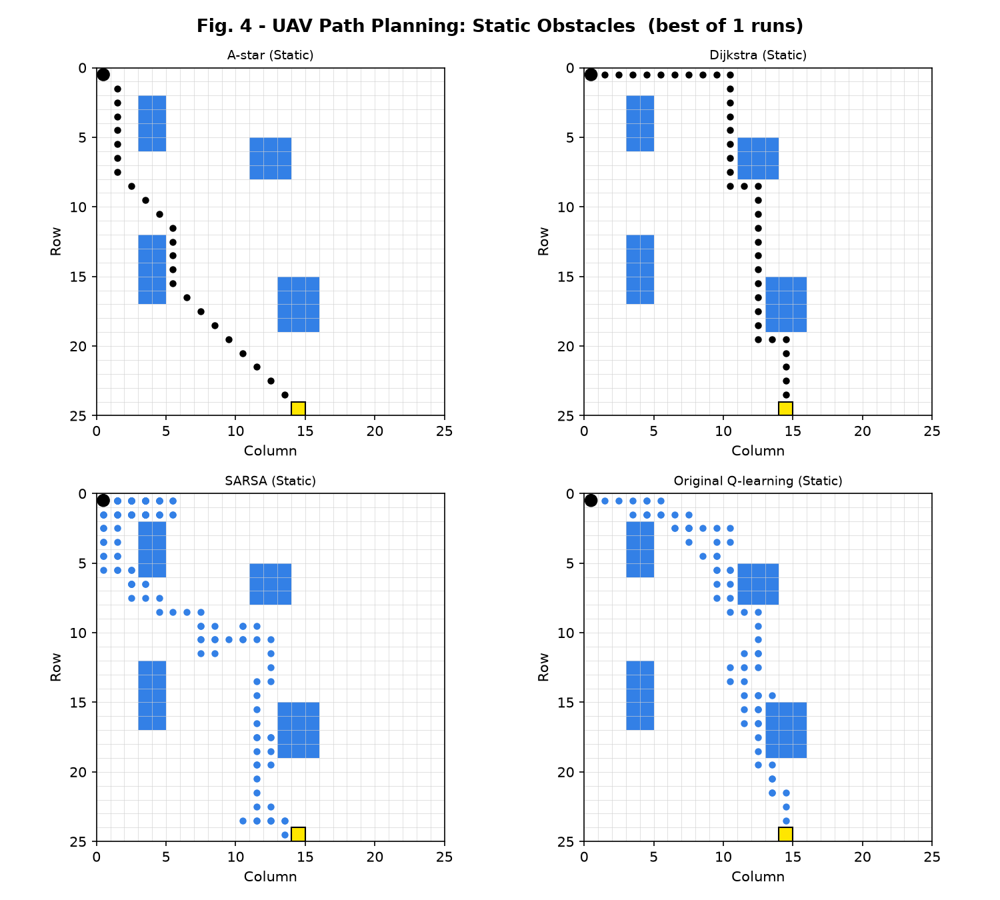
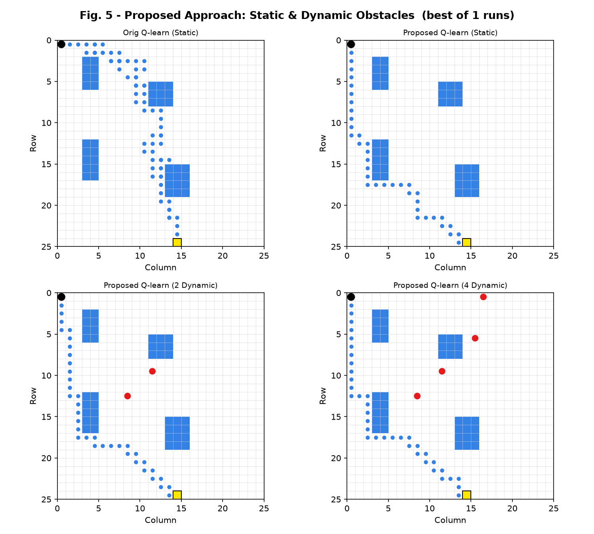
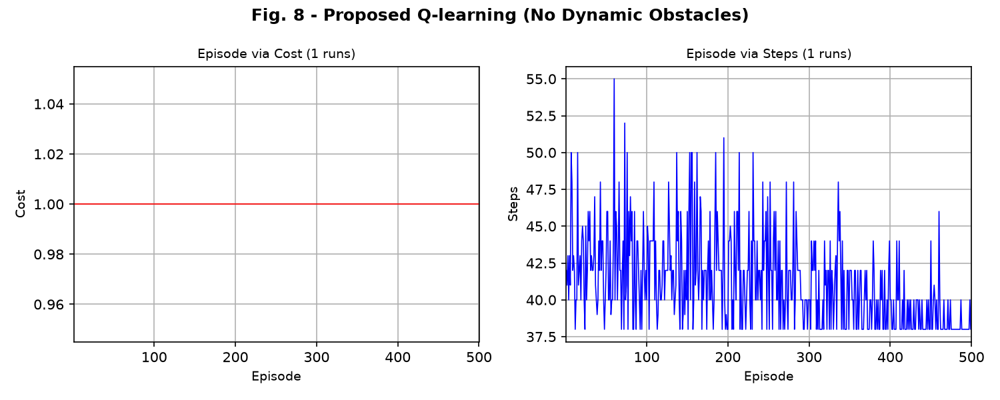
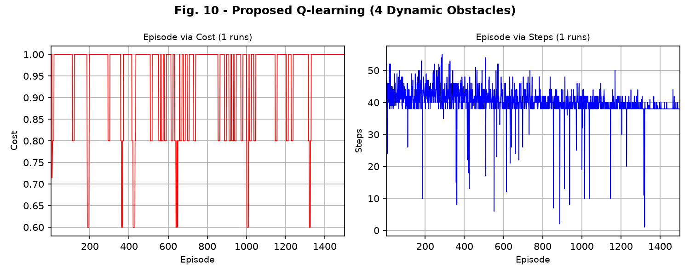
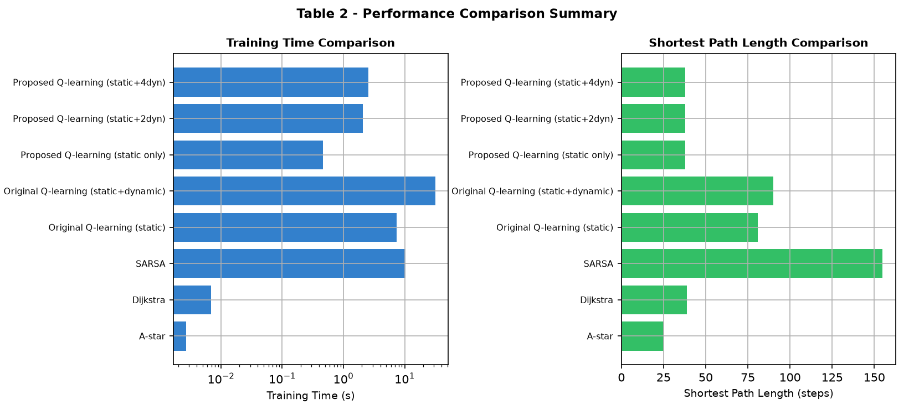

# Q-Learning-Based UAV Path Planning with Dynamic Obstacle Avoidance

A Python implementation and comparative study of path-planning algorithms for Unmanned Aerial Vehicles (UAVs), reproducing and extending the work from **Sonny et al. (2023)**. The key contribution is a **Proposed Q-learning with Shortest Distance Priority (SDP)** that significantly reduces the number of training episodes required compared to the original Q-learning approach.

## Results

All algorithms are benchmarked on a **25×25 grid** with 4 static obstacles. The Q-learning variants are further tested with 2 and 4 dynamic obstacles.

| Algorithm | Scenario | Shortest Path |
|---|---|---|
| A\* | Static | 38 steps |
| Dijkstra | Static | 38 steps |
| SARSA | Static | ~38 steps |
| Original Q-learning | Static | ~38 steps |
| Original Q-learning | 4 dynamic | ~38 steps |
| **Proposed Q-learning (SDP)** | **Static** | **~38 steps (500 eps)** |
| **Proposed Q-learning (SDP)** | **2 dynamic** | **~38 steps (1500 eps)** |
| **Proposed Q-learning (SDP)** | **4 dynamic** | **~38 steps (1500 eps)** |

The proposed method converges in **500 episodes** (static) vs. **1000 episodes** for the original — a 2× improvement — while maintaining path quality.

### Sample Output Figures

| Fig. 4 — Static obstacle paths | Fig. 5 — Proposed approach |
|---|---|
|  |  |

| Fig. 8 — Proposed Q-learning (static) | Fig. 10 — Proposed Q-learning (4 dynamic) |
|---|---|
|  |  |



## Algorithms Implemented

| Module | Algorithm |
|---|---|
| `src/astar_planner.py` | A\* with octile-distance heuristic |
| `src/dijkstra_planner.py` | Dijkstra's shortest path |
| `src/sarsa_planner.py` | SARSA (on-policy TD control) |
| `src/qlearning_original.py` | Q-learning with experience replay |
| `src/qlearning_sdp.py` | **Proposed**: Q-learning + SDP + experience replay |

### What is SDP?

During the exploration phase (ε-greedy), the original Q-learning picks a random action. The **Shortest Distance Priority (SDP)** variant instead biases exploration toward the action that moves the UAV closest to the goal (measured by Euclidean squared distance), skipping blocked cells. This guided exploration dramatically speeds up convergence.

## Project Structure

```
.
├── main.py                  # Entry point — runs all algorithms and saves figures
├── run.sh                   # Convenience script: creates venv, installs deps, runs
├── requirements.txt         # numpy, matplotlib
├── src/
│   ├── astar_planner.py
│   ├── dijkstra_planner.py
│   ├── sarsa_planner.py
│   ├── qlearning_original.py
│   ├── qlearning_sdp.py
│   ├── build_obstacle_mask.py
│   ├── generate_dynamic_obstacles.py
│   ├── move_dynamic_obs.py
│   ├── policy_rollout.py
│   ├── plotting.py
│   └── reconstruct_path.py
└── Fig*.png / Performance_Summary_Table2.png   # Generated output figures
```

## Quick Start

```bash
# One-liner: creates venv, installs deps, runs everything
bash run.sh
```

Or manually:

```bash
python -m venv .venv
source .venv/bin/activate      # Windows: .venv\Scripts\activate
pip install -r requirements.txt
python main.py
```

Running `main.py` will:
1. Execute all 6 planners (A\*, Dijkstra, SARSA, Original Q-learning ×2, Proposed Q-learning ×3)
2. Print a performance comparison table (training time, shortest/longest path)
3. Save 7 figures (`Fig4`–`Fig10`, `Performance_Summary_Table2.png`) to the project root

## Hyperparameters (Table 1)

| Parameter | Value |
|---|---|
| Grid size | 25 × 25 |
| Experience replay buffer (`b`) | 5000 |
| Learning rate (`α`) | 0.3 |
| Exploration rate (`ε`) | 0.9 |
| Max steps per episode | 3000 |
| Discount (`γ`) | linearly annealed 0.1 → 0.9 |
| Episodes — Original Q-learning (static) | 1000 |
| Episodes — Original Q-learning (dynamic) | 4000 |
| Episodes — SARSA | 1500 |
| Episodes — Proposed Q-learning (static) | **500** |
| Episodes — Proposed Q-learning (dynamic) | **1500** |

## Environment Setup

- Source: row 0, col 0 → `(0, 0)`
- Goal: row 24, col 14 → `(24, 14)`
- Static obstacles: 4 rectangular regions (0-based coordinates)
- Dynamic obstacles: randomly spawned each episode, move one step per timestep

## Requirements

- Python 3.8+
- `numpy`
- `matplotlib`

## Reference

> Sonny, A., et al. (2023). *Q-learning-based unmanned aerial vehicle path planning with dynamic obstacle avoidance.* Applied Soft Computing.
